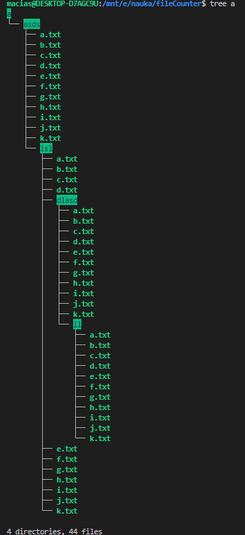
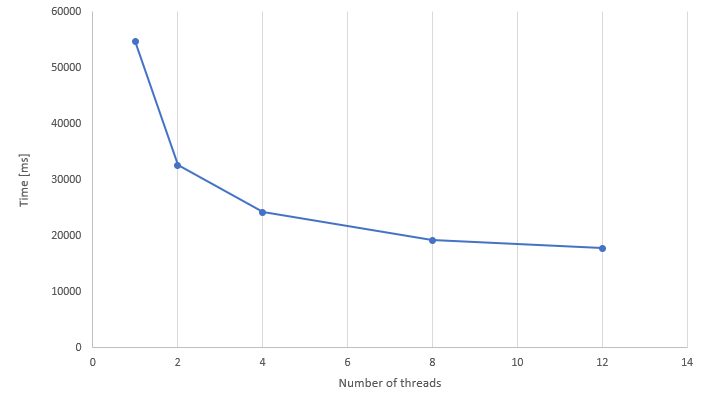
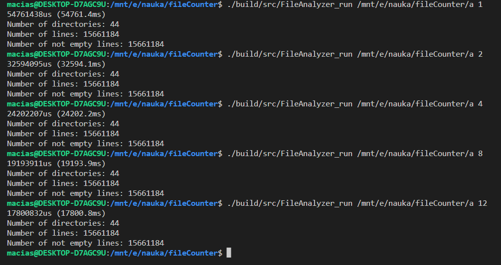

##  File Analyzer

 
This project is a simple directory analazyer, which handles recursive directories too. 
  

## Geting Stareted - Linux 
 

To run File Analyzer:

1. Clone the repo

        https://github.com/Molter23/FileAnalyzer.git 

2. Build and compile project

        mkdir build && cd build
        cmake .. 
        make all

3. Run File Analyzer

        ./src/FileAnalyzer_run [path to dir] <number of threads>

4. In ordere to run the tests, just run

        ./test/FileAnalyzer_test

## Benchmarking 

To measure  time i used file structure like this: 
                

Where every txt file contain 355936 not empty lines.

Only part which could be run in parallel were measuerd. Time was measured for 1, 2, 4, 8, 12(hardware max) threads. 

# Results

## Chart 

